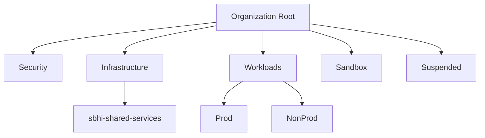

# Architecture

## Overview

The landing zone is an AWS Organization with a single management account, a small
set of organizational units, and member accounts placed inside them. Everything
lives in `eu-west-1`.



The management account sits at the root, outside any OU, because AWS does not allow it
to be moved into one.

## Organizational units

Each OU exists to be a policy boundary. An OU with no service control policy
attached to it does nothing, so the structure below is currently shape without
enforcement; see [Decisions](decisions.md#9-service-control-policies-are-not-yet-written).

| OU | Purpose |
| --- | --- |
| Security | Log archive and security tooling accounts. Empty today. |
| Infrastructure | Shared services used across workloads: networking, CI, artefact storage. |
| Workloads | Parent for application accounts, split by environment. |
| Workloads/Prod | Production workloads. Intended to carry the strictest policies. |
| Workloads/NonProd | Development and staging. |
| Sandbox | Experimentation. Intended to carry spend and region restrictions. |
| Suspended | Accounts pending closure. Intended to carry a deny-all policy. |

`Suspended` is deliberately part of the structure from the start: moving a
compromised or decommissioned account into a deny-all OU is faster and more
reversible than closing it, and account closure cannot be undone on demand.

## Accounts

| Account | OU | Purpose |
| --- | --- | --- |
| management | Root | Organization management, Identity Center, Terraform state. |
| sbhi-shared-services | Infrastructure | Shared infrastructure across workloads. Currently the hosted zone delegated to the homelab cluster, and the identity and discovery resources that cluster's own repository defines alongside it. |

The management account is kept as empty as possible. It can create accounts,
edit service control policies, and administer Identity Center, so anything
running there has organization-wide blast radius. Workloads belong in member
accounts.

Member accounts are declared with two protections:

```hcl
close_on_deletion = false

lifecycle {
  prevent_destroy = true
}
```

`prevent_destroy` turns an accidental removal into a hard error rather than a
deletion. `close_on_deletion = false` means that if the resource is ever removed
anyway, Terraform drops it from state and leaves the AWS account intact, which is
recoverable by re-importing. Closing an account is not: it starts a 90-day
suspension, closures are rate-limited, and the root email is effectively burned.

## State management

Two root modules, two different state strategies.

**`bootstrap/`** creates the S3 bucket that holds all other state. Its own state
is local and it is applied by hand. This is the one deliberate exception to
"everything in CI, everything remote" and is explained in
[Decisions](decisions.md#1-bootstrap-state-is-local-and-manual). The bucket has
versioning, SSE, a full public access block, `BucketOwnerEnforced` ownership, and
a bucket policy denying any non-TLS request.

**`environments/management/`** uses the S3 backend with `use_lockfile = true`,
S3-native conditional-write locking, which replaces the DynamoDB lock table that
older setups used.

## Identity and access

Human access is through IAM Identity Center. There are no IAM users.

```
Identity Center user  →  group  →  permission set  →  account
```

Access is assigned to **groups**, never directly to users. Adding or changing who
has access is then a membership change rather than a rewrite of every account
assignment.

| Component | Value |
| --- | --- |
| Instance | Organization-owned, single region (`eu-west-1`) |
| Identity source | Identity Center directory (no external IdP) |
| Group | `Administrators` |
| Permission set | `AdministratorAccess`, 4-hour session |

Identity Center assigns permissions **per account, not per OU**. There is no way
to grant a group access to an entire OU, so every new account needs its own
assignment. This is why account assignments are driven by a map:

```hcl
locals {
  sso_accounts = {
    management      = var.management_account_id
    shared_services = aws_organizations_account.sbhi_shared_services.id
  }
}
```

Applications never use Identity Center users or IAM users. They use IAM roles:
instance profiles, task roles, execution roles, Pod Identity, or OIDC federation
for anything running outside AWS. See
[Decisions](decisions.md#5-applications-use-iam-roles-not-users).

## DNS and external dependencies

Part of this landing zone's trust chain sits outside AWS and outside this
repository. It is recorded here because no amount of reading the Terraform will
reveal it.

```
registrar  →  DNS  →  mailbox  →  account root  →  the organization
```

Account root email is the recovery path when Identity Center is unavailable, and
it is delivered through an external registrar, DNS provider and mail provider.
Compromise or loss of any link is equivalent to compromise or loss of the
organization, so those accounts are part of the security boundary. See
[decision 11](decisions.md#11-the-account-root-email-domain-lives-outside-the-organization).

### Zone layout

```
example.com                apex zone, external DNS provider, edited by hand
  MX SPF DKIM DMARC        external mail provider
  www                      public site, manual record
  homelab    NS ───────→   Route 53 hosted zone in sbhi-shared-services
                             cert-manager writes ACME challenge records here
                             IAM role scoped to this hosted zone only
```

Automation never writes into the apex zone, which carries the MX records for
account recovery. See
[decision 12](decisions.md#12-automation-never-gets-write-access-to-mail-records).

## Workloads outside AWS

A workload can run outside AWS and still need a small AWS footprint. The homelab
cluster is the current instance: it runs on hardware that is not part of this
organization, and needs DNS it can write to plus an identity AWS will trust.

Its footprint lives in `sbhi-shared-services`, defined across two repositories:

| Resource | Defined in | Why |
| --- | --- | --- |
| Hosted zone for the delegated subdomain | this repository | Anchors a delegation edited by hand at the external DNS provider. |
| OIDC provider for the cluster's issuer | the workload's repository | Derived from the cluster's signing key. |
| Role the cluster's workload assumes | the workload's repository | Scoped to the zone, trusted by that provider. |
| Certificate, bucket and distribution publishing the discovery documents | the workload's repository | Recreated with the cluster's identity. |
| Records pointing at the cluster | the workload's repository | Follow the cluster's current address. |

The split is the rule in
[decision 14](decisions.md#14-the-landing-zone-owns-what-outlives-the-workload):
this repository owns what outlives the workload, the workload's repository owns
what shares its lifecycle. The contract between them is the zone's name, resolved
with a `data` source rather than shared through state.

No credential is issued for any of it. The kubelet projects a service account
token, the AWS SDK exchanges it through `AssumeRoleWithWebIdentity`, and the trust
policy pins both `aud` and `sub`, so only the named service account can assume the
role rather than any workload in the cluster. See
[decision 5](decisions.md#5-applications-use-iam-roles-not-users).

The signing key lives in the workload repository's Terraform state rather than on
the node. A node rebuild therefore leaves the published discovery documents, the
OIDC provider and the trust policy all valid, which has been exercised in
practice rather than assumed.

The footprint sits in `sbhi-shared-services` rather than a dedicated workload
account because the cluster only writes DNS. A dedicated account becomes
worthwhile once it consumes AWS services: holding data, running compute, or
reaching anything whose blast radius is worth isolating.

## What Terraform does not manage

Some parts of this landing zone have no Terraform resource and are applied by
hand. They are recorded here so the gap is visible rather than forgotten.

| Thing | Why |
| --- | --- |
| Enabling IAM Identity Center | No provider resource exists; the instance is created in the console. |
| Identity Center portal subdomain | No API. Console only, and changeable only once. |
| MFA policy and authentication settings | No provider resource. |
| Initial user password / invitation | A user created through the API has no password and receives no invitation email; it must be triggered from the console. |
| Management account name | No provider resource. Set with `aws account put-account-name`. |

The provider *does* cover alternate contacts (`aws_account_alternate_contact`)
and primary contact details, which are worth setting in code rather than by hand.
